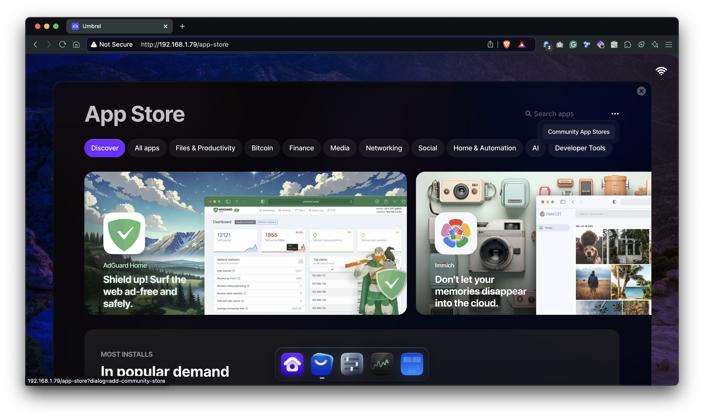
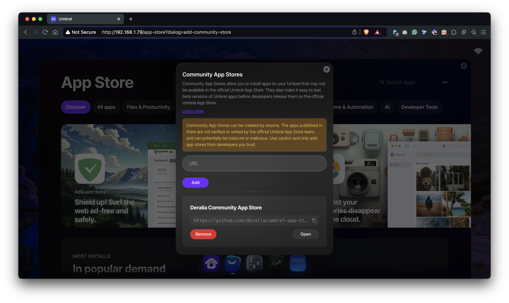
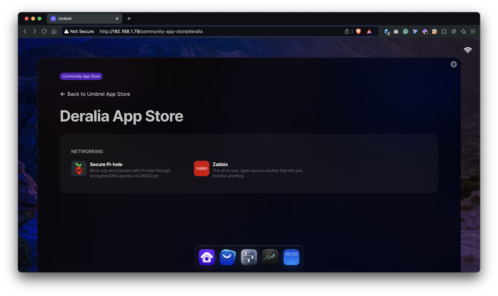

# Deralia's Umbrel Community App Store

This repository is another Community-driven App Store for Umbrel OS.

## How to use:

### Step 1: Browse the Community App Stores

Open the Umbrel OS App Store and click on the triple-dot icon in the top right corner.

There you can access to the `Community App Stores`.



### Step 2: Add this Community App Store

You need to copy and paste the URL of this repository in the input field and click on the "Add" button.

```
https://github.com/deralia/umbrel-app-store
```



### Step 3: Browse this Community App Store

Now you can access to the `Deralia's Umbrel Community App Store` and install the apps you want.

Just click on the `Open` button to see the list of available apps.


